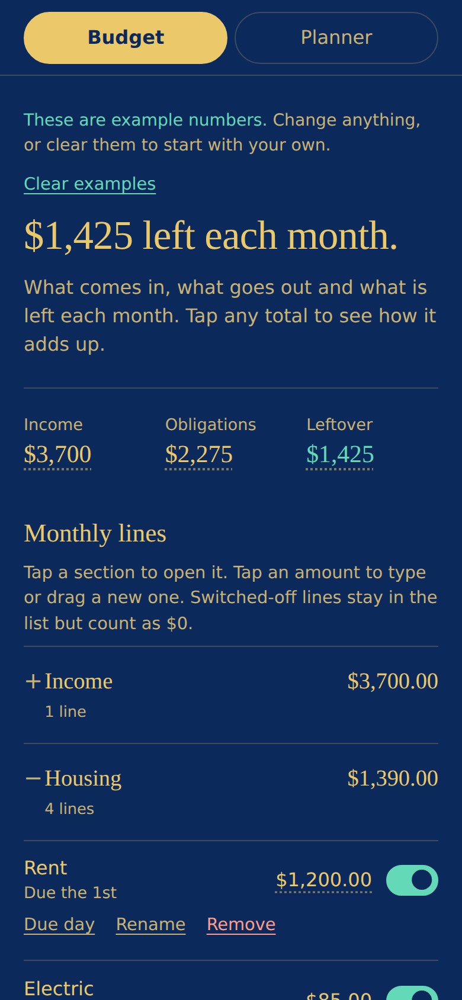
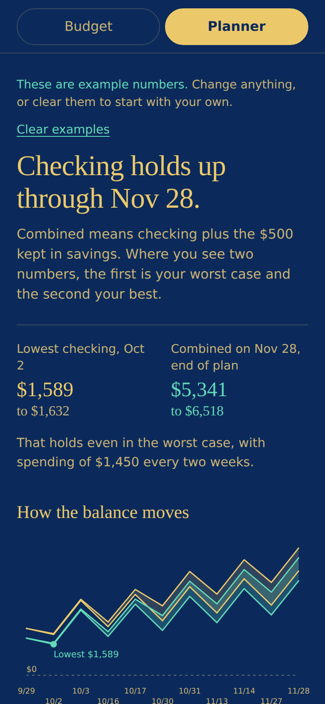

# Cash planner and budget

A phone-first budget and cash planner that runs entirely in your browser. No account, no server and nothing leaves your device.

**[Open the app](https://vaughnsjm.github.io/fin-the-money-planner/)**

  
  

## What it does

The app has two tabs that share one set of data.

**Budget** is your typical month. Sections hold your lines (rent, subscriptions, debt payments and so on), each with an amount, a due day and a switch to leave it out without deleting it. Income, obligations and leftover sit at the top, and tapping any of them shows the math behind it.

**Planner** is your cash over time. It walks your balance from today through every payday, the day before each payday (usually your low point) and any date you add. Where you give a best and worst case, every balance shows the range. Tap a balance to see exactly how it got there, then tap any amount in that walk to try a different number for that date only. Tried amounts are underlined in mint and never change your settings.

## How it works

- **Everything starts empty.** Blank amounts count as $0. Load example numbers to look around first.
- **Every amount can be typed or dragged.**
- **Changes that matter ask first.** Adding or removing a line shows its effect on your totals before anything changes, and every confirmed change lands in a list with undo.
- **Backups.** Your data saves in the browser automatically. Load a backup file to move it to another device.

## Privacy

This is a single HTML file with no backend. Your numbers are stored only in your browser's local storage on that device and are never sent anywhere. The only outside request is for web fonts. Clearing your browser data or using Start over removes everything.

## Use it on your phone

Open the link above in Safari or Chrome, then use Add to Home Screen. It opens like an app. Downloading the file and opening it from Files on an iPhone will not work, because iOS previews HTML files without running them.

## Run it yourself

Download `index.html` and open it in any desktop browser, or host it on any static host.

## About

Built by Joseph M. Vaughns, a healthcare operations and analytics professional, as a planning tool for real money decisions: a move, a new paycheck and the weeks in between. Designed and built with Claude.

This is a planning aid, not financial advice.

## License

MIT
